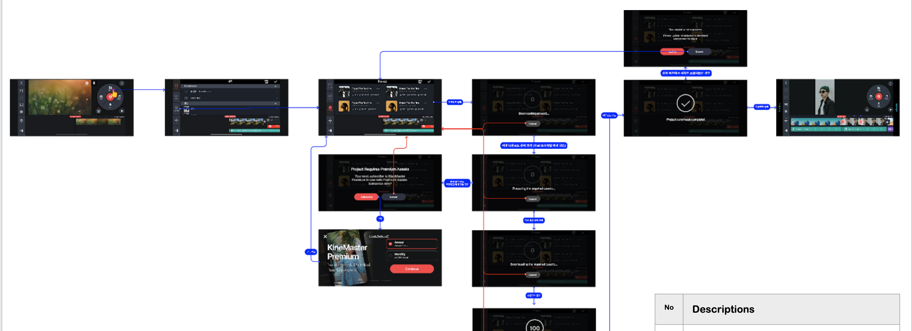
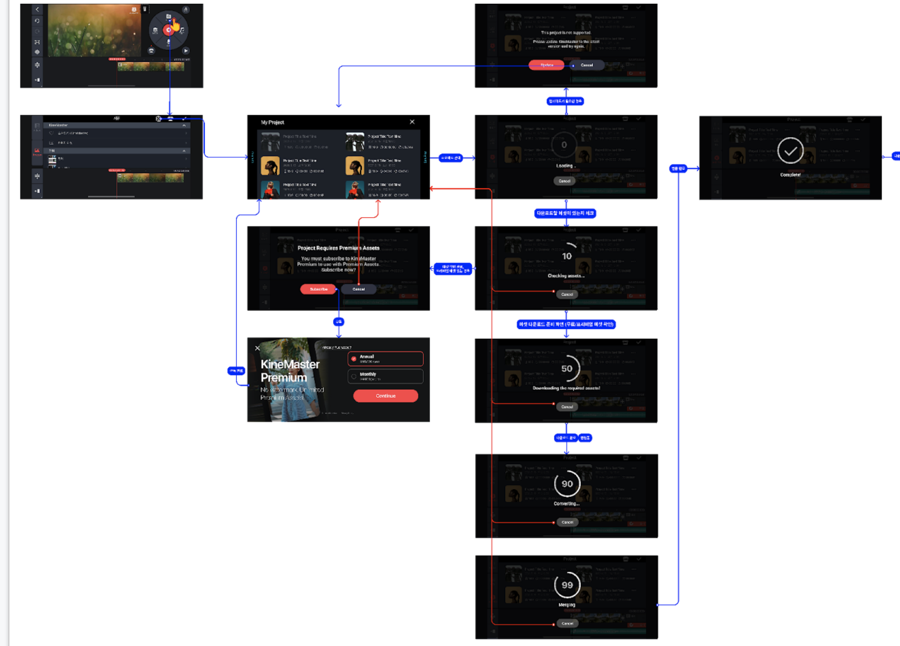

# Project Merge 

시작일: 2022. 10 20
made by: Guun.Park
- - -
figma UI link : [linlk](https://github.com/kyler-jeon/forDocument/blob/test-sylar/6.4/%EA%B0%9C%EC%9D%B8%EC%A0%95%EB%B3%B4%EC%B2%98%EB%A6%AC%EA%B0%9C%EC%84%A0/%EA%B0%9C%EC%9D%B8%EC%A0%95%EB%B3%B4%EC%B2%98%EB%A6%AC%EA%B0%9C%EC%84%A0.md "")
- - -
## 요구사항

1.  Media Browser에  Project 아이콘 추가
	* Media Browser에서 Project 아이콘을 추가합니다.
	아이콘 활성화 기준 (활성화 / 비활성화): Time line에 Clip이 한개 이상 있는 경우
	* Timeline에서 Clip / Layer 선택후 Replace 를 탭한 경우 실행되는 Media Browser에서는 아이콘을 노출하지 않습니다.

2. Project list

	* 프로젝트는 한번에 한개씩만 추가가 가능합니다. 
	* Import하는 Project의 Thumbnail, Title, Ratio, Duration, Size를 보여줍니다.

3. Timeline에서 Merge한 Project는
Project Duplicate 했을 때와 동일하게 처리

	* Merge된 Clip , Layer들은 Original Project 를 Duplicate 했을 때 제공되는 형태와 동일하게 Timeline에 추가됩니다.
(편집중인 Project의 비율로 자동 변환)
	* Clip, Layer들은 Merge 될 때 기존 타임라인 규칙에 따라 추가됩니다.
		1. Header는 프로젝트가 추가된 직후에 첫번째 클립 시작점에 위치합니다.
		2. Transition이 적용된 클립 A,B 사이에 Merge를 하는 경우에는 Transition 위치는 클립 A 뒤에(Merge 가장 앞) 위치하게 됩니다.  
		3. 불러오는 파일의 마지막 클립에 Transition은 Merge하지 않습니다. (제거)
		4. Merge 구간의 Layer들은 Duplicate 되었을 때와 동일하게 처리합니다. 

4. Preview에서 Merge된 Layer들은 최상단에 위치

	* Preview에서 Merge된 Layer들은 최상단에 위치합니다. 

---
# UX Flow -  Merge Project (Android)

---
# UX Flow -  Merge Project (iOS)

---