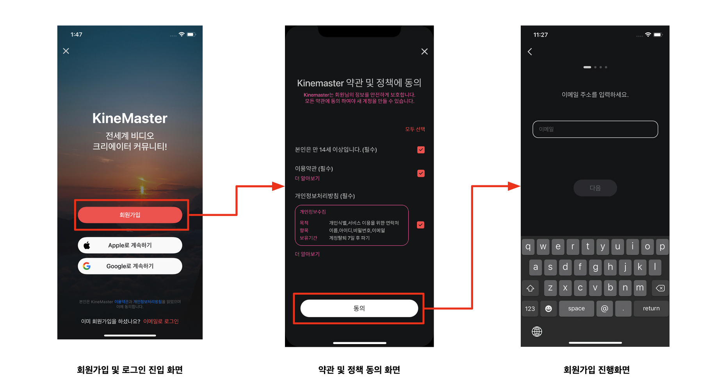
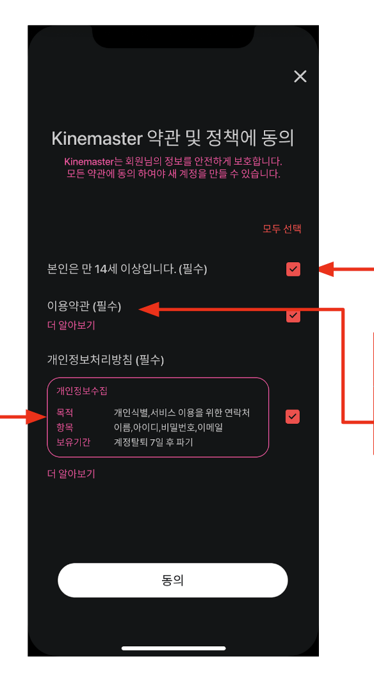

# 개인정보처리 개선 기획안
EDIT: 2022. 10 20

made by: Guun.Park

- - -
figma UI link : [아무거나sampleLink](https://www.figma.com/file/7J7f2KD0euKHl1bubZ9zhM/%EA%B8%B0%ED%9A%8D_KM6.4_Save-as-Video---%EA%B0%80%EC%9D%B4%EB%93%9C-%EB%AC%B8%EA%B5%AC-%EC%B6%94%EA%B0%80?node-id=2:30&t=GQzkpJPYEqT72sHt-1 "")
- - -
## 개선사항
| 구분                  | 개선 요구 항목                              |
| --------------------- | ------------------------------------------- |
|                       | 개인정보 수집 이용 포괄 동의                |
| 개인정보 수집         | 개인정보수집 이용 동의                      |
|                       | 개인정보 수집 이용 동의시 필수 항목 고지    |
| 개인정보 이용 및 제공 | 국외 이전 고지 내용                         |
| 이용자 권리           | 만 14세 미만 서비스 이용 시 법정대리인 동의 |

- - -
## 개선요청을 적용한 화면 및 Flow

- - -
개인정보 수집 ∙ 이용 동의

1. 개인 정보 수집·이용 동의 시 필수 항목 고지 개선방안
	* 이용자의 개인정보를 수집·이용하는 경우 필수 고지항목을 이용자에게 알리고 동의

	* 개인정보 수집·이용 시 필수 고지 항목 
		1. 개인정보의 수집·이용 목적 
		2. 수집하는 개인정보의 항목 
		3. 개인정보의 보유·이용 기간
	* 법정 고지사항’만을 간결하게 고지하고, 일반인이 이해할 수 있을 정도의 ‘쉬운 용어’를 사용

2. 개인정보 수집∙이용 동의 개선방안
	* 개인정보를 수집하는 경우 이용자에게 수집·이용 동의
	* 이용자가 동의여부를 결정하고 자발적 의사에 따라 선택할 수 있는 방법으로 마련
		* 이용자가 직접 동의 여부를 선택할 수 있도록 ‘동의함’에 미리 표시하지 않아야 함.

3. 개인정보 수집∙이용 동의 시 동의절차 없이 포괄 동의 개선방안
	* 개인정보처리자가 개인정보 처리에 대하여 이용자의 동의를 받을 때 각각의 동의 사항을 구분하여 이용자에게 명확히 알리고 각각 동의를 받음

---
## 국외이전 고지 내용
### 제11조(개인정보의 국외 이전)
#### (1) 고객의 거주지가 대한민국이 아닌 경우, 회사가 수집한 개인정보는 아래와 같이 고객이 거주하는 국가 이외의 지역에 있는 서버에서 보관, 처리될 수 있습니다.

|       업체명       |                                                              |
| :----------------: | ------------------------------------------------------------ |
| 개인정보 이전 국가 | 회사 본사가 위치한 대한민국 및 미국, 아프리카, 홍콩, 인도, 싱가포르, 호주, 일본, 중국, 캐나다, 독일, 아일랜드, 영국, 이탈리아, 프랑스, 스웨덴, 바레인, 브라질 등 Amazon Web Services의 리전이 위치한 국가 |
|      이용목적      | 회사 서버의 저장 및 처리, 고객이 요청한 서비스 및 관련 문의 처리 |
|      이전항목      | 제 3조에 따른 개인정보 (성명,이메일 주소, 비밀번호 등)    |
|  이전일시 및 방법  | 서비스 이용 시점에 네트워크를 통한 전송                      |
|  보유 및 이용기간  | 계정 삭제 시 또는 법정 의무 보관 기간                        |

#### (2) 개인정보 이전 시 회사는 개인정보를 보호하고 적절한 수준의 보호 조치를 취하기 위해 개인정보 보호법에 의거한 보호 장치를 적용합니다.

| 국외이전 고지 내용 개선방안                                  |
| ------------------------------------------------------------ |
| • 정보통신서비스를 제공하는 서버가 국외에 위치하므로 개인정보의 국외 이전에 관한 4가지 사항을 개인정보 처리방침에 고지  개인정보의 국외 이전 시 고지 항목  1. 이전되는 개인정보 항목  2. 개인정보가 이전되는 국가, 이전일시 및 이전방법  3. 개인정보를 이전받는 자의 성명(법인인 경우에는 그 명칭 및 정보관리책임자의 연락처)  4. 개인정보를 이전받는 자의 개인정보 이용목적 및 보유ᆞ이용 기간 |

---