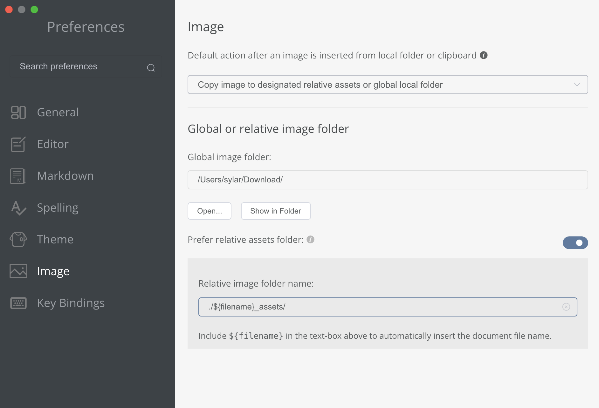

###### MarkDown 문서 작성을 위해 MarkText tool download 및 setting

---

### MarkText 다운로드

 [Releases · marktext/marktext · GitHub](https://github.com/marktext/marktext/releases)

---

### 문제 해결

* 0.17.1 일때 **M1 계열 맥**이면 실행이 되지 않음. 
  
  * 터미널 열어서 아래 문구 입력 하면 실행 잘됨

```
xattr -cr /Applications/MarkText.app
```

---

### 설정

###### github 이미지 링크를 위해 아래와 같이 설정한다.

Choose '**Copy image to designated relative assets or global local folder**'

```
./${filename}_assets/
```


