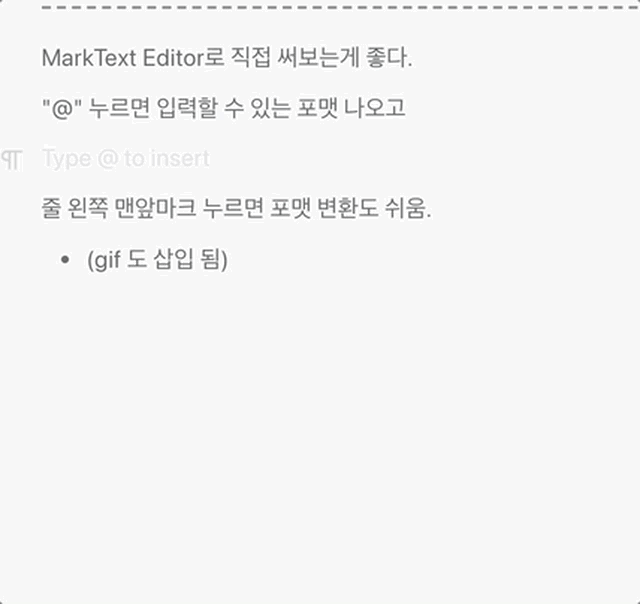

# Markdown 작성법

[마크다운(Markdown) 사용법 · GitHub](https://gist.github.com/ihoneymon/652be052a0727ad59601)

---

MarkText Editor로 직접 써보는게 좋다. 

"@" 누르면 입력할 수 있는 포맷 나오고 

줄 왼쪽 맨앞마크 누르면 포맷 변환도 쉬움. 

* (gif 도 삽입 됨)

---

Image는 cmd+v로 직접 붙여넣으면 '1-markdownSetting' 의 setting대로 

'현재 folder/현재파일명_assets/' 밑에 자동 copy되어 첨부된다. 

* 기존 이미지 위에 덮어 쓰는 방식으로 붙여 넣기를 하면 쓰레기 파일이 쌓이므로 직접 지워줘야 한다. 

* 
